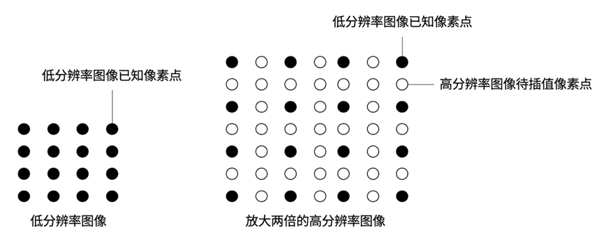
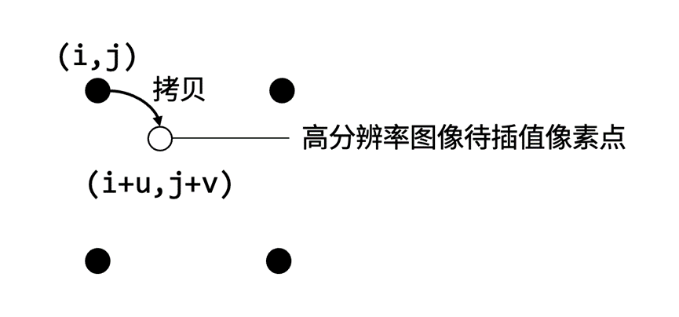
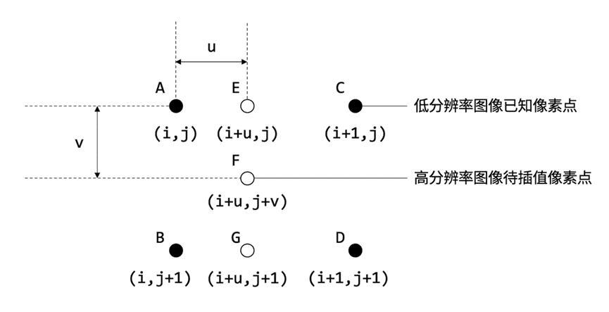
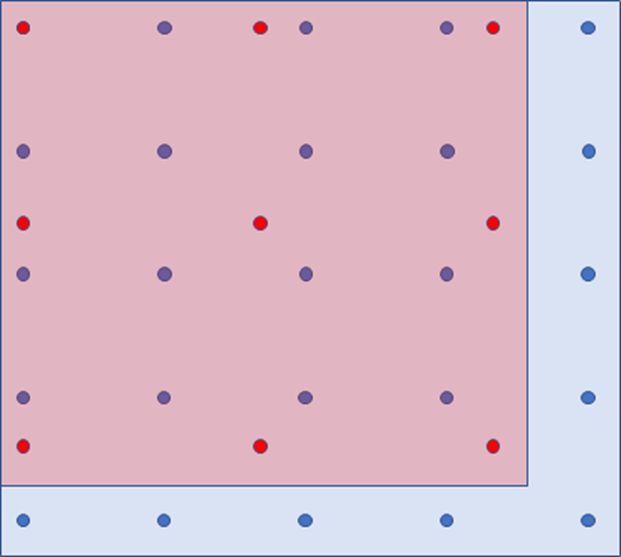
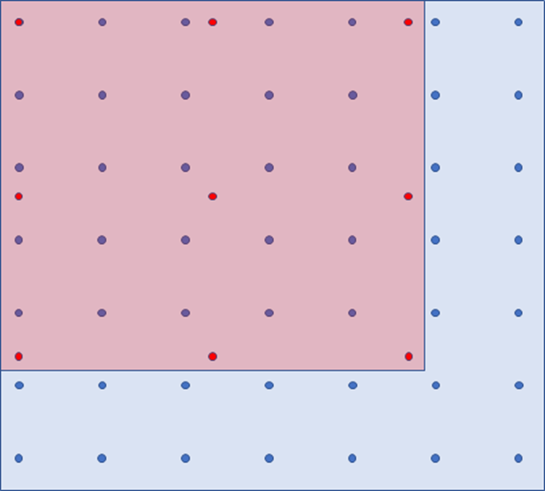
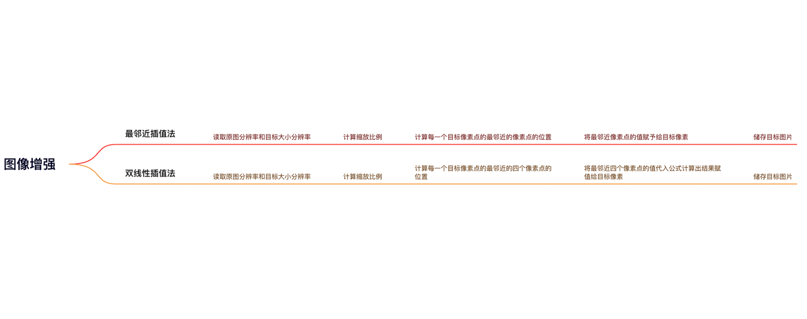

# 图像增强

## 一、项目背景

### 1. 图像增强
图像增强是指增强图像中的有用信息，它可以是一个失真的过程，其目的是要改善图像的视觉效果，针对给定图像的应用场合。有目的地强调图像的整体或局部特性，将原来不清晰的图像变得清晰或强调某些感兴趣的特征，扩大图像中不同物体特征之间的差别，抑制不感兴趣的特征，使之改善图像质量、丰富信息量，加强图像判读和识别效果，满足某些特殊分析的需要。

### 2. 图像插值技术
如图所示，图像插值如下图所示，一幅图像由许多像素点组成，当图像放大两倍时，需要使用N（低分辨率像素的数目）个己知像素值估计出3N个未知像素值。如果图像插值算法性能不理想，将会使得放大后的图像模糊、失真，甚至难以分辨，图像插值算法也可以用于缩小图像。

### 3. 常见插值算法
- 线性插值
  - 最近邻插值
  - 双线性插值
  - 双三次插值

- 非线性插值
  - 基于边缘信息
  - 基于小波基数

### 4. 最邻近插值
最近邻插值算法又称为零阶插值算法，即令插值后的图像像素的值等于距离它最近的像素的值，这种方法失真严重但运算简单，最邻近插值算法的基本插值公式如下：
$$
I_h(i + u, j + v) = I_l(i, j)
$$
下图展示了最近邻插值算法的插值过程，其中黑色点位低分辨率图像已知的像素点，白色点为高分辨率图像待插值的像素点。

### 5. 双线性插值
这种方法最常用，是opencv的`resize()`函数的默认值，双线性插值算法中待查值的点的值是原始低分辨率图像与其相邻的4个已知点的像素值的加权平均，即利用相邻4个点的像素值对待插值的点的像素值进行线性估计。以水平方向为例，做一次线性插值，插值满足下式：

$$
\frac{f(x_2) - f(x_1)}{x_2 - x_1} = \frac{f(x)- f(x_1)}{x - x_1}
$$

需要满足
$$
x_1 \leq x \leq x_2, x_2 = x_1 + 1
$$
，则目标点的插值结果为：
$$
f(x) = (x_2 - x)f(x_1) + (x - x_1)f(x_2)
$$
上述插值公式其实就是将和的像素值看作两个点，做一条线段，为线段上一点，与的距离就可以对应到在线段上距的距离，与的距离也可以对应到在线段上距的距离，距越近对的影响就越大，距越近对的影响就越大。

同理可以得到竖直方向上的插值公式：
$$
f(y) = (y_2 - y)f(y_1) + (y - y_1)f(y_2)
$$
而双线性插值可以看作是先在水平方向做两次线性插值，再在竖直方向上对前面的两个插值结果做一次线性插值，具体如下图所示，其中黑色点位低分辨率图像已知的像素点，点F为待插值的点，E、G为辅助点。

A点与C点做一次水平方向上的线性插值得到E点，B点与D点做一次水平方向上的线性插值得到G点，E点与G点做一次竖直方向上的线性插值即可得到F点。

最终可以得到双线性插值公式：
$$
I_h(i + u, j + v) = v(u(I_l(i + 1, j + 1)) + (1 - u)I_l(i, j + 1)) + (1 - v)(uI_l(i + 1, j) + (1 - u)I_l(i, j))
$$
化简得：
$$
I_h(i + u, j + v) = (1 - u)(1 - v)\cdot I_l(i, j) + (1 - u)v\cdot I_l(i, j + 1) + u(1 - v)\cdot I_l(i + 1, j) + uv\cdot I_l(i + 1, j + 1)
$$

### 6. 上采样（放大图像）
以双线性插值为例，所有变换以水平方向的宽度为例，竖直方向上的高度同理。

假如要将的图像插值成的图像，则在水平方向上的宽比为，竖直方向上的高度同理。

如高分辨率图像中的的点对应输入图像中的的点，设为，找到周围的四个点分别为，则处的值为：
$$
f_P = 0.4\cdot f_{(0, 0)} + 0.6\cdot f_{(0, 1)} + 0 \cdot f_{(1, 0)} + 0 \cdot f_{(1, 1)}
$$
其余点同理，但是这样会产生一个问题，插值时有的点的坐标已经超出了原图的坐标范围，依然以的图像插值成的图像为例，在水平方向上，的图像的坐标为，最后一个坐标已经超出了原图像的水平方向上的坐标范围(0, 1, 2), 再假如是， 的图像放大为 的图像，一个方向的坐标就有, 其中有两个坐标()超出了原图的坐标范围。

一个处理方式时将超出的坐标插值中需要使用到的不存在的点的像素值设置为白色(或者其他固定颜色), 这中处理方法计算上简单, 但是效果不太好, 这里提供一种效果较好的处理方法，我们将坐标变换修改为：
$$
Y = \frac{w_0 - 1}{w}X
$$
其中 为低分辨率图像宽度, 为高分辨率图像宽度，这样 图像水平方向上的坐标值变为, 图像水平方向上的坐标值变 , 这样所有的点都存在四个相邻的点了。

这里还会有一个问题, 这个问题在下采样中更加明显, 我们将在下采样中说明这个问题。

### **7.**下采样（缩小图像）

以双线性插值为例, 所有变换以水平方向的宽度为例, 竖直方向上的高度同理。

假如要将 的图像插值成 的图像, 则在水平方向上的宽比为 , 高分辨率图像的水平方向坐标变换为 , ( 为原始图像中的浮点数坐标, 为缩小后图像中的整数坐标)这里不存在点超出原图坐标范围的问题。

如缩小后图像中 的点对应原始图像中 的点, 设为 , 找到 周围的四个点分别为 , 则 处的值为：
$$
f_Q = 0.33\cdot f_{(0, 1)} + 0.67\cdot f_{(0, 2)} + 0 \cdot f_{(1, 1)} + 0 \cdot f_{(1, 2)}
$$
其余点同理，这里存在一个问题, 我们对左上角的点的利用会比对右下角的点的利用率更高, 如下图所示, 蓝色的点为原始图像上的点, 红色的点为缩小后图像上的点, 可以看到, 缩小后图像上的点整体为与原始图像的左上角, 导致原始图像左上角的点的权值更高。

若考虑将 的图像插值成 的图像, 则会出现更严重的问题, 如下图所示, 下图中最右边一列和最下面一行的点直接被忽略了, 插值时没有用到它们。

上采样也存在这个问题, 但是上采样只存在左上角的点权值更高的问题而不存在右下角部分的被忽略的问题，解决这个问题的方法时将两个图像的几何中心对齐, 相当于将图中红色部分向右下方移动他们宽度差的一半, 即移动 (其中 为原始图像宽度, 为缩小后图像宽度), 因此坐标变换变为:
$$
Y = (X + 0.5) \times \frac{w_0}{w} - 0.5
$$
同理, 上采样的坐标变化变为：
$$
Y = (X + 0.5) \times \frac{w_0 - 1}{w} - 0.5
$$

## **二、项目目标**

**1.**主要目标

通过命令行参数传入原始图像路径，生成图像途径，生成图片高度和宽度等参数，进行图像增强处理，包括：最邻近差值和双线性差值。

**2.**目标分解

- 解析命令行参数

- 对图像文件处理

- 输出到指定位置

## 三、技术选型思路

